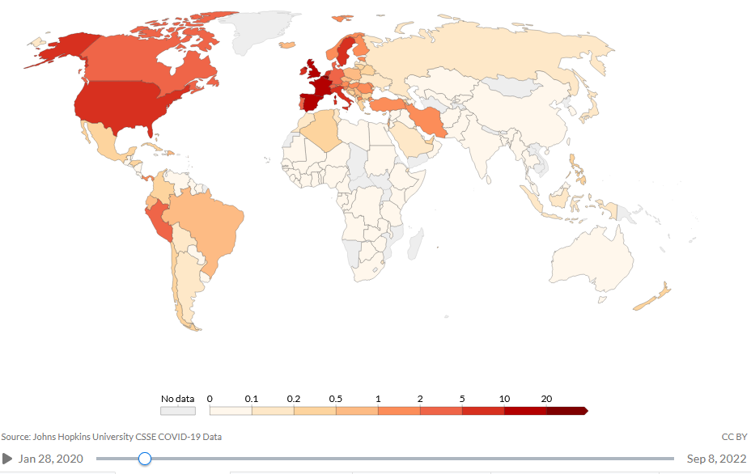

# Building a COVID-19 Prediction App to Forecast ICU Patients per Million People

### **Problem Description:**
Month-long lockdowns were decided in a large number of countries based on the occupancy of the intensive care units. The aim of the project is a global but country-specific forecast of the occupancy of intensive care units in hospitals due to COVID-19. Being able to estimate this size one to two weeks in advance is very important, especially in times of a pandemic and especially in countries with chronically overcrowded intensive care units.

### **Solution Approach:**
There are a numberous approaches for estimating intensive care bed occupancy. In principle, they can be divided into deterministic and probabilistic models. The former model types are strongly assumption-driven and therefore often very error-prone if only a few of the assumptions are incorrect. The data-driven probabilistic models, on the other hand, are very promising if the data basis is good, since they are not or only slightly dependent on assumptions about the system to be described. For more details on this topic, please read the scientific literature. However, the amount of data on COVID-19 has been growing steadily since the beginning of 2020. For me as a data scientist, it is therefore obvious to try to investigate such an important target variable as the occupancy of intensive care units using data-driven probabilistic models.

- **Solution Step 1:** Get the data, understand the data, play with the data and develop ml prediction models, compare the models, select and tune model etc... All this experimental work can be found in jupyter notebooks in the experiment folder; different modeling approaches were tried out; the most promissing approach for robust covid forecasting is in the "regression_model.ipynb"

- **Solution Step 2:** Develop and deploy the app... all of the implementation stuff is in the streamlit_app folder