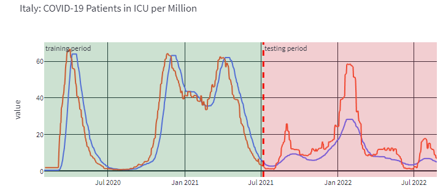

### **Problem Description:**
Month-long lockdowns were decided in a large number of countries based on the occupancy of the intensive care units. The aim of the project is a global but country-specific forecast of the occupancy of intensive care units in hospitals due to COVID-19. Being able to estimate this size one to two weeks in advance is very important, especially in times of a pandemic and especially in countries with chronically overcrowded intensive care units.

### **Solution Approach:**
There are a numberous approaches for estimating intensive care bed occupancy. In principle, they can be divided into deterministic and probabilistic models. The former model types are strongly assumption-driven and therefore often very error-prone if only a few of the assumptions are incorrect. The data-driven probabilistic models, on the other hand, are very promising if the data basis is good, since they are not or only slightly dependent on assumptions about the system to be described. For more details on this topic, please read the scientific literature. However, the amount of data on COVID-19 has been growing steadily since the beginning of 2020. For me as a data scientist, it is therefore obvious to try to investigate such an important target variable as the occupancy of intensive care units using data-driven probabilistic models.

***Image Description:*** 
*Actual ICU patient number (blue curve) and the running 14-day forecast (red curve). Ideally the 14-day forecast is a copy of the actual ICU patient number shifted by 14 days to the left. It can be seen that the forecast for Italy is very accurate for the training period but less accurate for the testing period (as expected). However, even in the testing period high correlation can be observed between the actual ICU curve and the forecast with the actual ICU curve following the forecast after a few weeks. This can be seen for quite a few months from the end of the training period into the testing period.*

### **App Usage:**
**- Step 1:** in the menue dropdown menue (top left) select "Predict ICU Patients"; on the next page press the "Update COVID-Data" button to download live data from ourworldindata.org\
**- Step 2:** Missing data is always present; set the maximal percentage of missing rows in each dataset of each country; if the percentage is increased, more countries will be available for prediction; however, this comes at the cost of more countries with messy data and therefore less accurate predictions for those countries\
**- Step 3:** Select a country of interest; a plot of each time series is depicted, at this step, it is important to check the quality of each time series; in case the quality is bad, the predictions will be poor\
**- Step 4:** Define the forecasting horizont in days; obviously, the longer the forecast, the less accurate\
**- Step 5:** Define the training period; this is a very crucial step in machine learning; in general, increasing the amount of data for model training the better in most cases (not all...depending on many issues); the forecast will be a running forecast from the day of the end of training until the present day (i.e. the the of the data download minus the number of days to predict)\
**- Step 6:** press the "train model" button to train the model; a state-of-the-art machine learning algorithm, a so-called Light-GBM (=Light Gradient Boosting Machine) is then trained in the background. Light-GBM is a free, open-source distributed gradient enhancement machine learning framework originally developed by Microsoft. Technically, Light-GBM is a gradient boosting framework that uses tree based learning algorithm. Light-GBM was used here because it is highly accurate and fast compared to most other ml-algorithms.\
**- Step 7:** have a look at the comparison between the actual ICU patients curve and the forecast; please note that both curve should correlate but not match each other; the reason being is that the actual icu patients curve shoulf follow the forecast; try out multiple countries and you will see that in numerours cases it is possible to predict the number of ICU patients with good accuracy for a couply of weeks into the testing period\
**- Step 8:** if you are interested in the features potentially driving icu patients in the nearby future, the press the "feature importance" button; note that correlation is not causation!\
**- Step 9:** enjoy playing with the app!